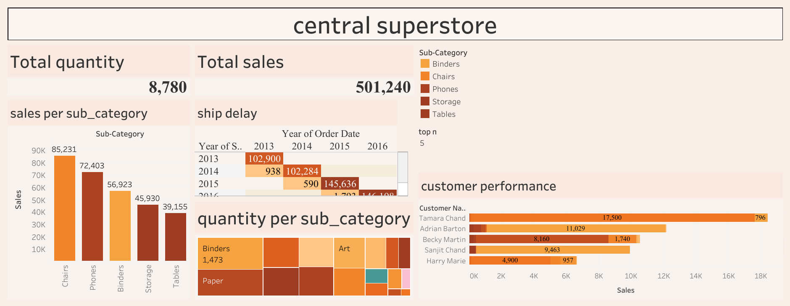

# central_superstore_dashboard
# 🛒 Central Superstore Sales Dashboard

This Tableau dashboard analyzes sales and customer performance for a central region store using superstore sales data. It provides visual insights into product category performance, customer contributions, and shipping trends.

## 📊 Key Features
- **Total Sales & Quantity**: Displays overall sales revenue and quantity sold.
- **Sales per Sub-Category**: Highlights performance of key product categories like Chairs, Phones, and Binders.
- **Ship Delay Heatmap**: Identifies delays across different years of order and shipping.
- **Customer Performance**: Top customers by sales contribution.
- **Quantity per Sub-Category**: Treemap visualizing product volume distribution.

## 📎 Tools & Technologies
- Tableau (Desktop Public Edition)
- Sample Superstore Dataset

## 📸 Dashboard Preview

## 👤 Author
**[Your Name]** – Data Analyst | BI Developer  
📧 [your.email@example.com]  
🌐 [Your LinkedIn or Portfolio]
